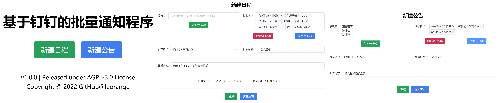

# 钉钉批量通知程序

## 开发背景

假如你拿到了一张excel名单，你需要通知名单中的同学或同事。如果直接@全体成员，会打扰到无关人员；逐个私聊往往工作量很大。

待通知的人员名单Excel类似于：

| **张三** |
| -------- |
| **李四** |
| **王五** |

拟通过这份名单，根据钉钉接口检索信息，并以**公告**或**日程**的形式批量通知他们。

## B站视频

+ 钉钉批量通知程序: https://www.bilibili.com/video/BV1aS4y147Nt/

## 初次使用

1. 您可以通过[**克隆代码**](https://github.com/laorange/dingtalk_sender/archive/refs/heads/master.zip)或[**下载发行版**](https://github.com/laorange/dingtalk_sender/releases)来获取程序。

2. 您需要在您的钉钉组织申请开发者权限，可参考这篇[文档](https://open.dingtalk.com/document/dashboard/become-a-dingtalk-developer)。

3. 然后，您需要创建及发布**企业内部应用-H5微应用**，可参考这篇[文档](https://open.dingtalk.com/document/org/microapplication-creation-and-release-process)。

4. 此时，您会来到如下图所示的页面，您会得到在后续步骤中需要用到的三个应用凭证（在图中以马赛克遮盖的地方）：

   1. `AgentId`

   1. `AppKey`

   1. `AppSecret`

   

5. 然后您需要在上图中以绿色框住的**权限管理**中，为您的应用添加下列权限：

   + 个人权限
     + 日历应用中日程写权限
     + 日历应用中日程读权限
     + 日历应用中日程闲忙状态读权限
   + 通讯录管理：
     + 通讯录部门信息读权限
     + 成员信息读权限
     + 通讯录部门成员读权限
   + 公告
     + 钉钉公告管理权限

6. 然后您可以开始运行程序了，需要以此填写**步骤4**中获取到的三个参数。

7. windows电脑上，程序将会在信息拉取完成后自动打开前端页面；其他操作系统请**在程序启动后**自行访问 `http://127.0.0.1:8095`。

8. 截图：

## 第一次使用后

每一次完成配置信息后（那三个应用凭证），程序会拉取部门信息，期间请耐心等待。

拉取信息完成后，将会在其**所在文件夹**下生成一个名为`settings.db`的文件，下次运行时自动读取；**其中包含应用凭证敏感信息，请妥善保管**！

如果您的应用凭证有变动，请删除这个文件，这样程序就会在下一次运行时要求您重新输入。

如果您的部门人员有所变动，请在"新建日程"或"新建公告"页面点击"刷新部门名单"。

## 继续开发

在 `utils\dingTalkHandler.py` 中封装了一系列对钉钉接口的操作方法，可为后来的项目提供参考。

